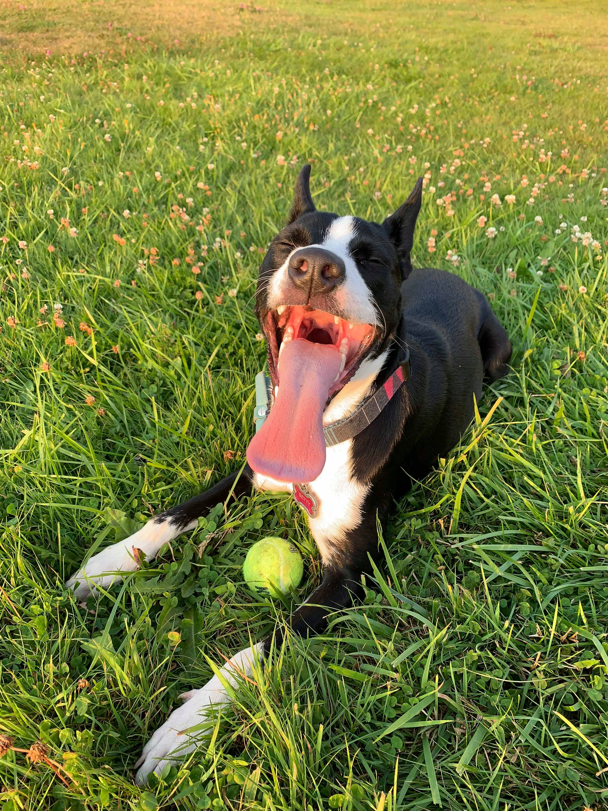
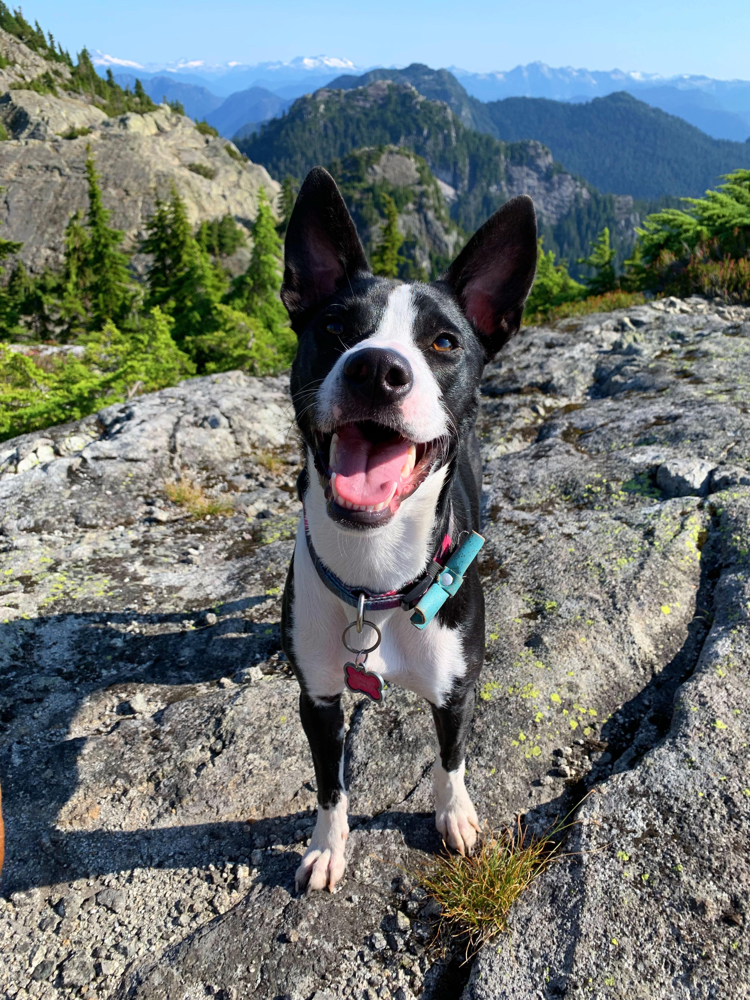
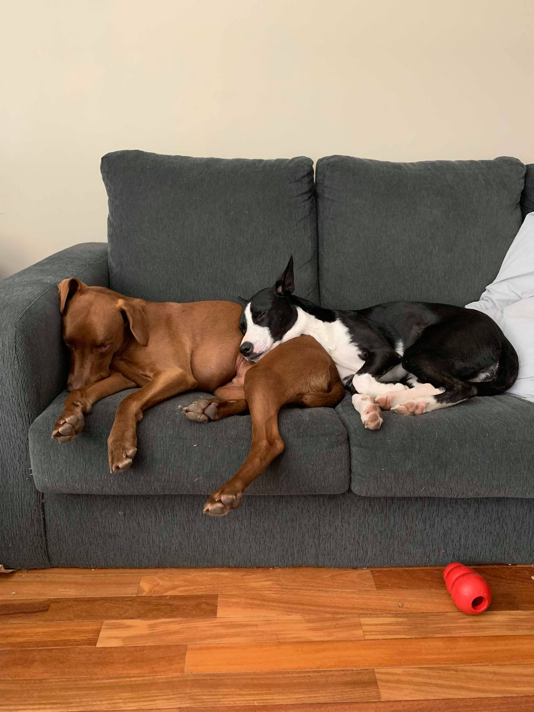

Year end reviews are *so tired* I know but here we are. 2019 was a good year all in all - I worked the same job and lived in the same country/city/home for the whole thing which was so lovely and relaxing compared to 2017/2018. I spent the whole year working remotely which I absolutely love. I did work I'm proud of, continued to learn a bunch from some really great coworkers, took on challenges that were beyond my comfort zone, etc. I travelled to a couple new places like Bavaria, where I could honestly live, and Vegas, which is whack in a way that's fun for about 1.75 days. In March we brought home dog #2, who was shipped up from Texas. She's a purebred mutt or maybe an alien space dog. She is a bit goofy looking (goes well with dog #1 in that respect) and has pointy satellite ears that are always ready to receive messages from her home planet. She's incredibly cute and also incredibly destructive and anyway I'm obsessed with her. 

Maybe my favourite thing I did this year though was get a library card and get back into a reading habit. I read tons as a kid but fell out of the habit in university. I read a lot this year (77 books according to [Goodreads](https://www.goodreads.com/user/year_in_books/2019/90618505), which was surprising given how slow I read). This can be partly attributed to spending so many hours/days/weeks(?) of the last year at the dog park, throwing the ball for my obsessive hyperenergetic dog (boring) while reading (less boring). I made a goal near the beginning of the year to read more stuff by non-white-men authors and the results were v good (nothing against y'all white dudes but I've been reading your stuff my whole life!). 

**A book I actually read at the very end of 2018 but is amazing and I think of often still and informed a lot of my reading in 2019:**

Just Mercy - Bryan Stevenson

**I don't like to pick favourites but if I had to it would be these two:**

Democracy may not exist but we'll miss it when it's gone - Astra Taylor  
We are never meeting in real life - Samantha Irby

**The first book I read all year which I didn't have the knowledge or vocabulary to criticize at the time but now I do and everyone is entitled to tell their truth but for me this was a big thumbs down:**

Hillbilly Elegy: J.D. Vance

**A book that was exactly the rebuttal to Hillbilly Elegy that I needed:**

What you are getting wrong about appalachia - Elizabeth Catte

**Some really incredible nonfiction that changed the way I think in some way or another:**

The new Jim Crow - Michelle Alexander  
Eloquent rage - Brittney Cooper  
How we get free - Keeanga-Yamahtta Taylor  
Thick - Tressie McMillan Cottom  
Highway of tears - Jessica McDiarmid  
Seven fallen feathers - Tanya Talaga  
So you want to talk about race - Ijeoma Oluo

**A book written about addiction that largely centered my home city and ripped my heart out and everyone should read it:**

In the realm of hungry ghosts - Gabor Mate

**Some really beautiful fiction:**

A woman is no man - Etaf Rum  
Sing, unburied, sing - Jesmyn Ward  
Everyone knows you go home - Natalia Sylvester  
A place for us - Fatima Farheen Mirza  
Where the crawdads sing - Delia Owens  
Homegoing - Yaa Gyasi

**Memoirs I loved even though I'm not usually big on the genre:**

Heavy - Kiese Laymon  
Heart berries - Terese Marie Mailhot

**Some classics I'm ashamed to say I'm just reading for the first time:**

The bluest eye - Toni Morrison  
Sister outsider - Audre Lorde  
Women, race & class and Freedom is a constant struggle - Angela Y Davis  
All about love - bell hooks  
If beale street could talk - James Baldwin

**Short story collections I enjoyed but I think I'm still learning how to read and appreciate short stories:**

All the names they used for god - Anjali Sachdeva  
What is not yours is not yours - Helen Oyeyemi  
Sabrina & Corina - Kali Fajardo-Anstine

**A beautiful poetry collection that made me realize I need to learn how to read poetry:**

If they come for us - Fatimah Asghar

**A novel I love love loved and didn't expect to:**

This is how it always is - Laurie Frankel

**Another novel I loved that I thought would be overhyped but was so endearing:**

Eleanor Oliphant is completely fine - Gail Honeyman

**A niche book about a hip hop group I'd never listened to but was really compelling because of the author's clear love for what he was writing about:**

Go ahead in the rain: notes to a tribe called quest - Hanif Abdurraqib

**Novels by indigenous authors that blew me away:**

The break - Katherena Vermette  
Monkey beach - Eden Robinson

**A book that was good but didn't resonate with me the way it did for seemingly every single other person that read it but it's a me problem not the book's problem:**

Pachinko - Min Jin Lee

**A book by one of my twitter faves which was obviously great:**

Hunger - Roxane Gay

**Graphic novels that taught me more about history and the human experience:**

Persepolis - Marjane Satrapi  
The best we could do - Thi Bui

**A book that was really super hyped and long/shortlisted for almost every book award but I wasn't ecstatic about:**

Disappearing Earth - Julia phillips

**A truly colossal disappointment, honestly not sure why I stuck it out:**

Zen and the art of motorcycle maintenance - Robert M Pirsig

There were more that were v good and more that were fine and are all on goodreads somewhere. I have learned that I'm too ADD to plan my reading out in advance so I have no idea what I'll read in 2020 but I'm sure it'll be good and I'll learn from it. Let me know what you read because I truly love talking about books.
